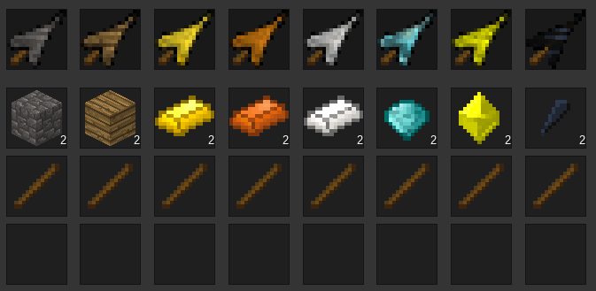
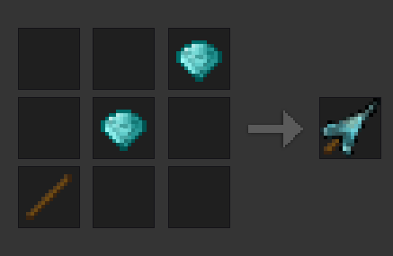

*“Last Knifes” adds various knifes that can be used to destroy mobs in a different way.*

## Default usage

This mod registers various knifes.

Those knifes can be crafted from sticks and their respective material.

Different material knifes can be used different times before they break.

Crafting the knifes needs one sticks and two of the material as shown in the image above.

Crafting is then done very similar to the other weapons.

The recipe shape is always the same, just interchange the head material.

## Durability

The durability is based on personal opinion.

| Hammer Material | Mod        | Durability (uses) |
|:----------------|:----------:|------------------:|
| Wood            | `default`  |                30 |
| Stone           | `default`  |                70 |
| Gold            | `default`  |               100 |
| Bronze          | `default`  |               150 |
| Steel           | `default`  |               200 |
| Diamond         | `default`  |               300 |
| Mese            | `default`  |               350 |
| Obsidian        | `default`  |               400 |

## Installation

You can check how to install by the following link: http://dev.minetest.net/Installing_Mods
##

Feel free to suggest changes.